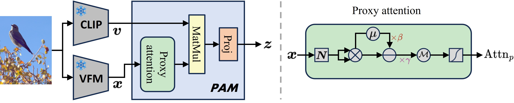

[](https://paperswithcode.com/sota/unsupervised-semantic-segmentation-with-9?p=proxyclip-proxy-attention-improves-clip-for)
[](https://paperswithcode.com/sota/unsupervised-semantic-segmentation-with-4?p=proxyclip-proxy-attention-improves-clip-for)
[](https://paperswithcode.com/sota/unsupervised-semantic-segmentation-with-3?p=proxyclip-proxy-attention-improves-clip-for)
[](https://paperswithcode.com/sota/unsupervised-semantic-segmentation-with-10?p=proxyclip-proxy-attention-improves-clip-for)
[](https://paperswithcode.com/sota/unsupervised-semantic-segmentation-with-8?p=proxyclip-proxy-attention-improves-clip-for)
[](https://paperswithcode.com/sota/unsupervised-semantic-segmentation-with-12?p=proxyclip-proxy-attention-improves-clip-for)
[](https://paperswithcode.com/sota/unsupervised-semantic-segmentation-with-11?p=proxyclip-proxy-attention-improves-clip-for)
[](https://paperswithcode.com/sota/unsupervised-semantic-segmentation-with-7?p=proxyclip-proxy-attention-improves-clip-for)

<div align="center">

<h1>ProxyCLIP: Proxy Attention Improves CLIP for Open-Vocabulary Segmentation</h1>

<div>
    <a href='https://mc-lan.github.io/' target='_blank'>Mengcheng Lan</a><sup>1</sup>&emsp;
    <a href='https://chaofengc.github.io/' target='_blank'>Chaofeng Chen</a><sup>1</sup>&emsp;
    <a href='https://keyiping.wixsite.com/index' target='_blank'>Yiping Ke</a><sup>2</sup>&emsp;
    <a href='https://scholar.google.com.hk/citations?user=q4lnWaoAAAAJ&hl=en&inst=8669986779262753491&oi=ao' target='_blank'>Xinjiang Wang</a><sup>3</sup>&emsp;
    <a href='https://scholar.google.com.hk/citations?user=PnNAAasAAAAJ&hl=en' target='_blank'>Litong Feng</a><sup>3</sup>&emsp;
    <a href='https://www.statfe.com/' target='_blank'>Wayne Zhang</a><sup>3,4</sup>&emsp;
</div>
<div>
    <sup>1</sup>S-Lab, Nanyang Technological University&emsp; 
    <sup>2</sup>CCDS, Nanyang Technological University&emsp; 
    <sup>3</sup>SenseTime Research&emsp;
</div>
<div>
    <sup>4</sup>Guangdong Provincial Key Laboratory of Digital Grid Technology&emsp;
</div>

<div>
    <strong>Accepted to ECCV 2024</strong>
</div>

<div>
    <h4 align="center">
        • <a href="https://arxiv.org/abs/2408.04883" target='_blank'>[arXiv]</a> •
    </h4>
</div>



</div>

## Abstract
> *Open-vocabulary semantic segmentation requires models to effectively integrate visual representations with open-vocabulary semantic labels. While Contrastive Language-Image Pre-training (CLIP) models shine in recognizing visual concepts from text, they often struggle with segment coherence due to their limited localization ability. In contrast, Vision Foundation Models (VFMs) excel at acquiring spatially consistent local visual representations, yet they fall short in semantic understanding. This paper introduces ProxyCLIP, an innovative framework designed to harmonize the strengths of both CLIP and VFMs, facilitating enhanced open-vocabulary semantic segmentation. ProxyCLIP leverages the spatial feature correspondence from VFMs as a form of proxy attention to augment CLIP, thereby inheriting the VFMs' robust local consistency and maintaining CLIP's exceptional zero-shot transfer capacity. We propose an adaptive normalization and masking strategy to get the proxy attention from VFMs, allowing for adaptation across different VFMs. Remarkably, as a training-free approach, ProxyCLIP significantly improves the average mean Intersection over Union (mIoU) across eight benchmarks from 40.3 to 44.4, showcasing its exceptional efficacy in bridging the gap between spatial precision and semantic richness for the open-vocabulary segmentation task.*

## Dependencies and Installation


```
# git clone this repository
git clone https://github.com/mc-lan/ProxyCLIP.git
cd ProxyCLIP

# create new anaconda env
conda create -n ProxyCLIP python=3.10
conda activate ProxyCLIP

# install torch and dependencies
pip install -r requirements.txt
```

## Datasets
We include the following dataset configurations in this repo: 
1) `With background class`: PASCAL VOC, PASCAL Context, PASCAL Context 459 (PC459), Cityscapes, ADE20k, ADE847, and COCO-Stuff164k, 
2) `Without background class`: VOC20, Context59 (i.e., PASCAL VOC and PASCAL Context without the background category), and COCO-Object.

For PASCAL Context 459 and ADE847, please follow the [CAT-Seg](https://github.com/KU-CVLAB/CAT-Seg/tree/main/datasets) to prepare the datasets.
For the other datasets, please follow the [MMSeg data preparation document](https://github.com/open-mmlab/mmsegmentation/blob/main/docs/en/user_guides/2_dataset_prepare.md) to download and pre-process the datasets. 
The COCO-Object dataset can be converted from COCO-Stuff164k by executing the following command:

```
python datasets/cvt_coco_object.py PATH_TO_COCO_STUFF164K -o PATH_TO_COCO164K
```

## Quick Inference
```
python demo.py
```


## Model evaluation
Please modify some settings in `configs/base_config.py` before running the evaluation.

For SAM and MAE, please download the checkpoints from [SAM](https://github.com/facebookresearch/segment-anything#model-checkpoints) and [MAE](https://github.com/facebookresearch/mae).


Single-GPU:

```
python eval.py --config ./config/cfg_DATASET.py --workdir YOUR_WORK_DIR
```

Multi-GPU:
```
bash ./dist_test.sh ./config/cfg_DATASET.py
```

Evaluation on all datasets:
```
python eval_all.py
```
Results will be saved in `results.xlsx`.

## Citation

```
@inproceedings{lan2024proxyclip,
      title={ProxyCLIP: Proxy Attention Improves CLIP for Open-Vocabulary Segmentation}, 
      author={Mengcheng Lan and Chaofeng Chen and Yiping Ke and Xinjiang Wang and Litong Feng and Wayne Zhang},
      booktitle={ECCV},
      year={2024},
}
```

## License
This project is licensed under <a rel="license" href="https://github.com/mc-lan/SmooSeg/blob/master/LICENSE">NTU S-Lab License 1.0</a>. Redistribution and use should follow this license.


## Acknowledgement
This study is supported under the RIE2020 Industry Align- ment Fund – Industry Collaboration Projects (IAF-ICP) Funding Initiative, as well as cash and in-kind contribution from the industry partner(s).

This implementation is based on [OpenCLIP](https://github.com/mlfoundations/open_clip) and [SCLIP](https://github.com/wangf3014/SCLIP). Thanks for the awesome work.

## Contact
If you have any questions, please feel free to reach out at `lanm0002@e.ntu.edu.sg`.
